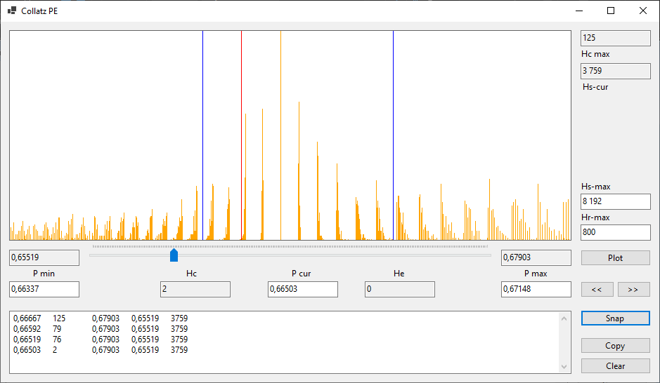

C# utility WinForms. Main Form View: 

Use text fields as peekers for range or current set. Click on field then set value on hystogram with cursor. Set range bounds for precise current positioning by slider.

Double clicks on range readonly fields restores bounds 0.5 or 1.0 respectively. Regular range field double click resets bound position. 

Double click on hystogram resolution text filed set it to 800 - image width in pixels. 

('Hr max' - resolution range 1E0:1E5, sparsed >800 plotted with gray color, and densed <800 with violet)

('Hs max' - points range 1E0:1E6, bigger will require separate thread)



Sequence unload is not implemented, since generator is currently has limitation by Int64. Use math packages for rigor statistics.

```csharp 
//---------------------------------------------------------------------
internal void ColStepPE()
{
  s = 0L; e = 0L; // n initialised in ColHystPE() with random value
                  // long Nmax = long.MaxValue / 4L;
  while (n != 1L) // reduced to Nmax, Collatz sequence generation
  {
    p =(n % 2L == 1L); if(p & n > Nmax) { e = 0L; break; }
    e+= p ? 0L :  1L ; s++;
    n = p ? 3L *  n  + 1L : n / 2L; 
  }
}// generate Collatz sequence and set even probability components e,s
//--------------------------------------------------------------------- 
```
